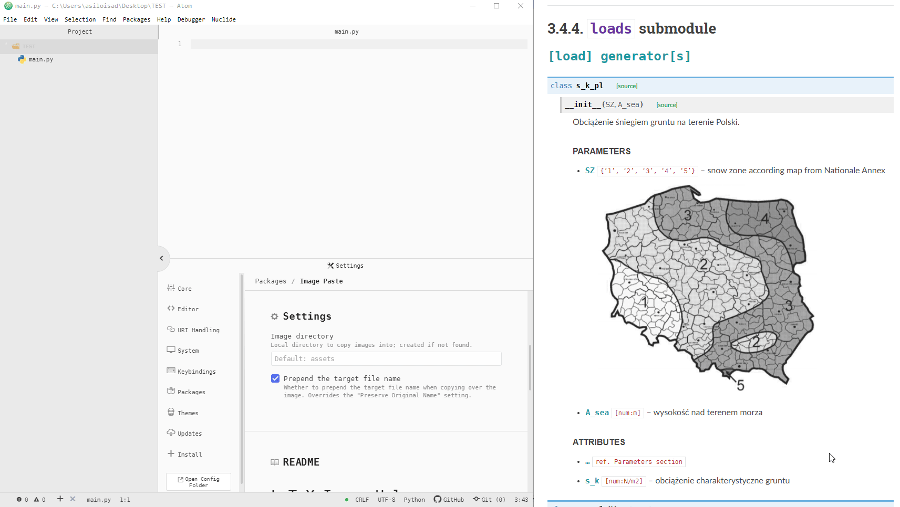

# image-paste

Copy image or take screenshot and paste it in text document. The image will be saved in given path and relative url will be inserted into document.

## Usage

1. Take a screenshot or copy any image to the clipboard.
2. Paste it into TextEditor, any language accepted.
3. Change the name of the image or accept the proposed name. Please note the assets path is included.
4. Press ENTER
5. See that an directory including the .png file was created and a figure URL has been inserted in the document. Please note if image already exists then it will be overwritten without any prompt.

## Fork

This for of LaTeX Image Helper package.

https://github.com/simon123h/latex-image-paste

The changes in compare to the original package:
* The scope of package has been extended to any gramma.
* The RAW path is inserted instead of latex-image block. This way it can be used in any schema, e.g. Python pyLatex package.
* The main path occur in path dialog now, so it can be changed in any moment without going to setting pane.

## See my another packages...

* [bacadra-atom](https://github.com/bacadra/bacadra-atom)
* [bib-finder](https://github.com/bacadra/bib-finder)
* [fold-section](https://github.com/bacadra/fold-section)
* [hydrogen-run](https://github.com/bacadra/hydrogen-run)
* [image-paste](https://github.com/bacadra/image-paste)
* [language-bacadra](https://github.com/bacadra/language-bacadra)
* [language-sofistik](https://github.com/bacadra/language-sofistik)
* [navigation-pane](https://github.com/bacadra/navigation-pane)
* [sofistik-atom](https://github.com/bacadra/sofistik-atom)
* [word-map](https://github.com/bacadra/word-map)
